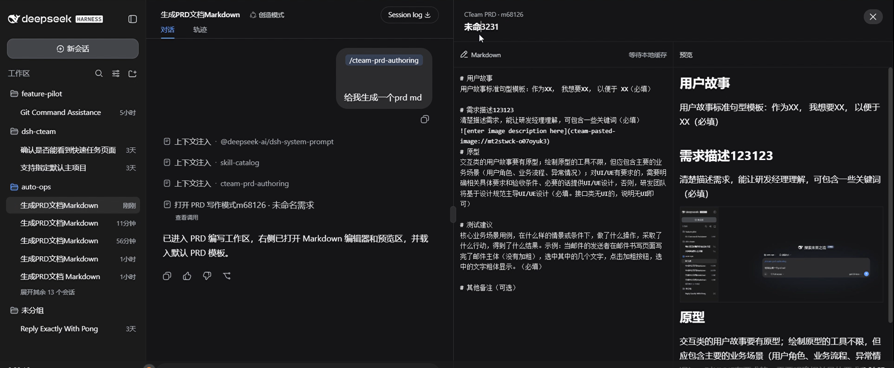
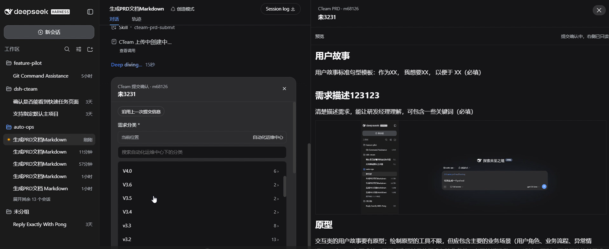
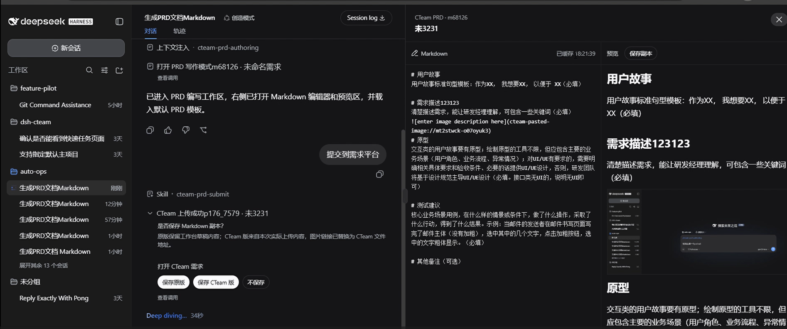
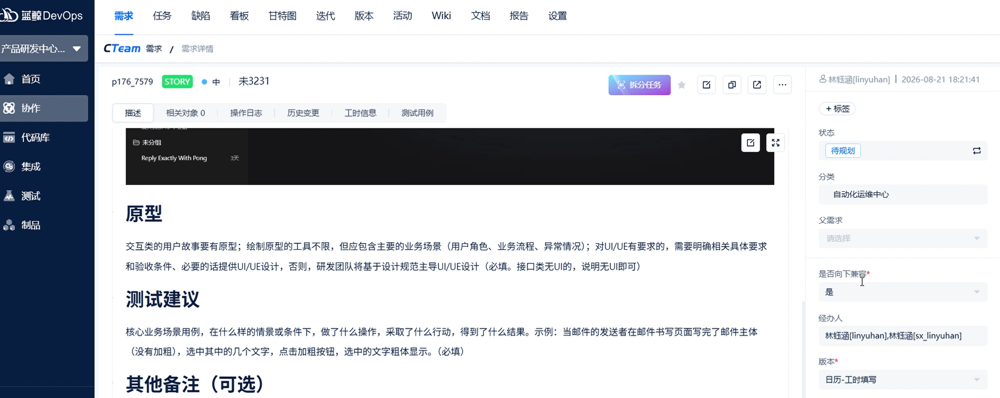

# dsh-cteam

`dsh-cteam` 是 DeepSeek Harness 的 CTeam 插件，用于在对话里读取需求、缺陷、Wiki，并支持在右侧工作台编辑 PRD / Markdown 后确认提交。

## 功能

- CTeam 读取：需求分类树、需求列表、需求详情、评论、图片、缺陷列表、筛选器、缺陷详情。
- PRD 工作台：在右侧面板编辑 Markdown，实时预览渲染结果，支持粘贴图片、修改标题、提交时切换只读预览。
- 提交确认：提交前在对话中打开确认表单，分类按 CTeam 层级逐级选择，字段控件按真实字段类型展示，并可沿用上次提交信息。
- 单据流转发现：查看缺陷等单据可流转状态、目标节点、必填字段和候选人。
- Wiki：读取 Wiki 库和分类树，查看 Wiki 内容，选择分类后导入 Markdown。

当前只支持创建新的线上需求，不支持修改已经创建的线上需求。

## 工作台

右侧工作台是插件的主要交互入口。读取单据时它展示详情和图片；进入 PRD / Wiki 写作时，它会变成 Markdown 编辑器和预览器，也可以承载用户提供的 Markdown 文本。编辑中的草稿保存在浏览器缓存里，用户可以在本地草稿中反复调整内容，再通过对话触发提交。



提交时，右侧工作台会进入只读预览，避免提交过程中继续修改导致本地内容和线上内容不一致；中间对话区域会弹出确认表单，用于选择需求分类和补充 CTeam 必填字段。



提交成功后，工作台保留本次提交内容的只读预览，并提示是否通过浏览器下载保存一份 Markdown 副本。图片上传和 CTeam 链接替换只作用于本次上传副本，不会覆盖右侧原始草稿；同一份草稿可以继续编辑，也可以再次提交到需求或 Wiki。



上传完成后，可以在 CTeam 页面查看已经创建的需求和正文图片。



## 注意事项

- 右侧工作台的编辑和自动保存依赖浏览器缓存，不会直接修改本地 Markdown 文件。
- 更建议先在本地 Markdown 文件中完成主要修改，再把 `dsh-cteam` 作为一次性操作用于提交 Markdown 到 CTeam 平台；工作台编辑只适合作为提交前的最后调优，不建议作为主要修改方式。
- 上传前粘贴的图片也保存在浏览器缓存中，还不是稳定的 CTeam 文件链接。
- 上传到需求或 Wiki 后，结果卡片会提供两种 Markdown 副本：原版保留工作台草稿内容，CTeam 版保存图片链接已替换为 CTeam 文件地址的上传内容。可按需要自行保存。
- 刷新浏览器、清理站点数据或更换浏览器配置可能导致未上传草稿和图片缓存丢失。

## 安装到 DSH

在插件目录执行：

```powershell
.\scripts\install-to-dsh.ps1 -Profile web -InstallDependencies
```

脚本会优先使用环境变量 `$env:DSH_HOME`。如果没有设置，会按当前仓库旁边的 `dsh-home` 推断。也可以显式指定：

```powershell
.\scripts\install-to-dsh.ps1 -DshHome "你的 dsh-home 路径" -Profile web -InstallDependencies
```

脚本会把 `dsh-cteam` 加入目标 profile 的 `package.json`：

- `dependencies.dsh-cteam = link:插件目录`
- `dsh.profile.bundles` 包含 `dsh-cteam`

如果不想让脚本执行安装依赖，去掉 `-InstallDependencies`，之后手动运行：

```powershell
pnpm install --dir "$env:DSH_HOME\profiles\web"
```

改完后重启 DSH Web。

## 配置

用户级配置文件：

```text
插件目录/local/local.json
```

项目级配置文件：

```text
项目目录/local/local.json
```

最小内容：

```json
{
  "projectId": "your-project-id"
}
```

模板见 [example.json](./example.json)。`projectId` 填自己的 CTeam 项目 ID，文档或测试里出现的 `m68126` 只是示例值。`local/` 是本地长期配置目录，不要提交到仓库。项目仓库里使用项目级配置时，也建议把项目自己的 `local/` 加入 `.gitignore`。

默认项目解析顺序：

```text
DSH profile 里的 config.projectId
项目目录/local/local.json
项目目录/.ops-local/cw-browser-login.json
插件目录/local/local.json
```

`config.projectId` 是挂载插件时写死的静态默认值；`local/local.json` 是用户本地配置，插件可以自动写入。日常推荐使用 `local/local.json`。

登录态优先复用浏览器里已经登录的 `devops.cwoa.net`。如果当前环境拿不到浏览器登录态，可在 `local/local.json` 里补旧方案字段：

```json
{
  "projectId": "your-project-id",
  "loginUrl": "https://devops.cwoa.net/...",
  "username": "your-username",
  "password": "your-password"
}
```

## 使用

可以直接用自然语言触发：

```text
生成一个 PRD
把这个 PRD 提交到 CTeam
查看需求 p176_7564
获取缺陷列表
查看这个缺陷可以流转到哪些状态
查看 Wiki 分类
导入 Markdown 到 Wiki
```

常用工具入口：

```text
cteam_open_prd_authoring
cteam_submit_prd_demand
cteam_list_demand_categories
cteam_list_demands
cteam_get_demand_detail
cteam_list_bugs
cteam_list_issue_filters
cteam_get_issue_detail
cteam_get_issue_transitions
cteam_list_wiki_tree
cteam_get_wiki_detail
cteam_submit_wiki_markdown
```

内置 skills：

```text
cteam-prd-authoring
cteam-prd-submit
cteam-wiki
cteam-wiki-submit
```

## 开发验证

```powershell
npm test
```

接口契约和历史验证记录见 [docs/cteam-api-contract.md](./docs/cteam-api-contract.md)。
